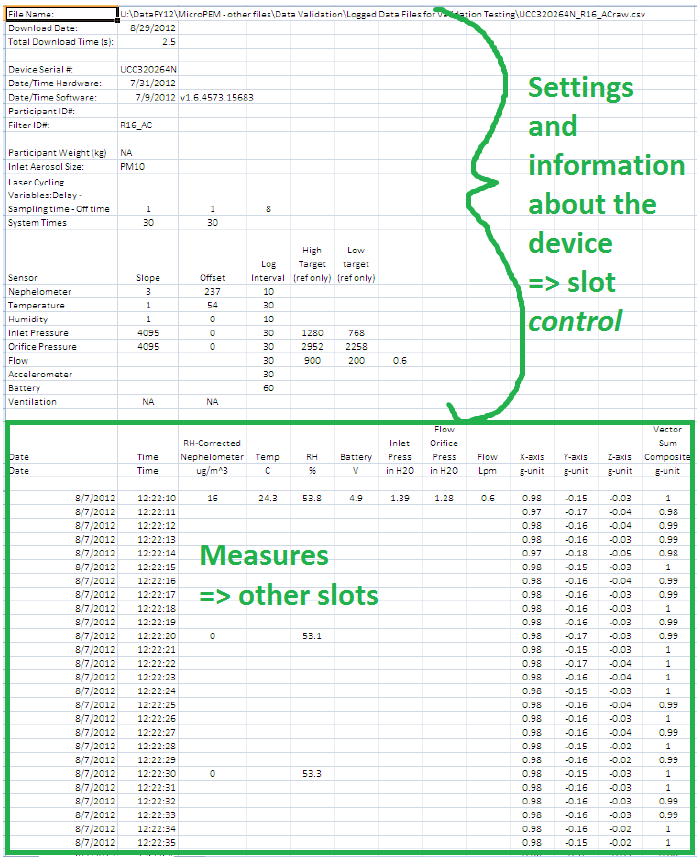
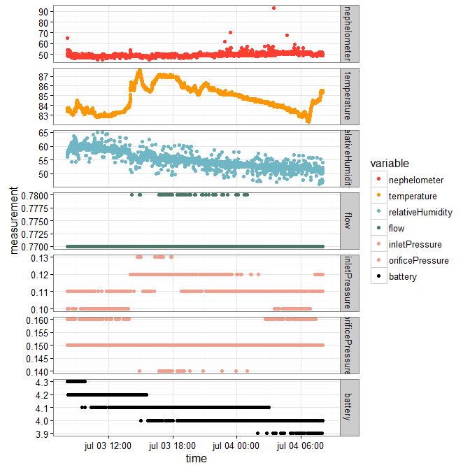
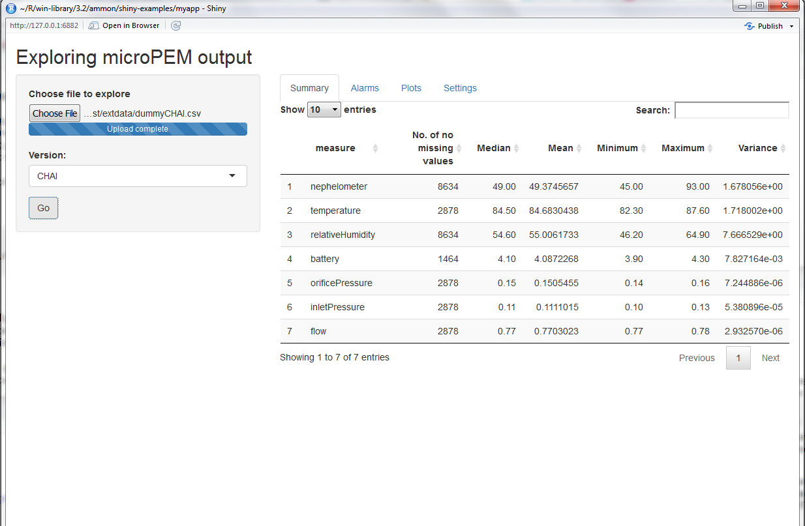
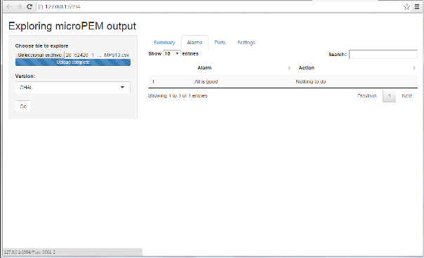
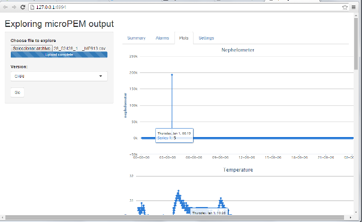
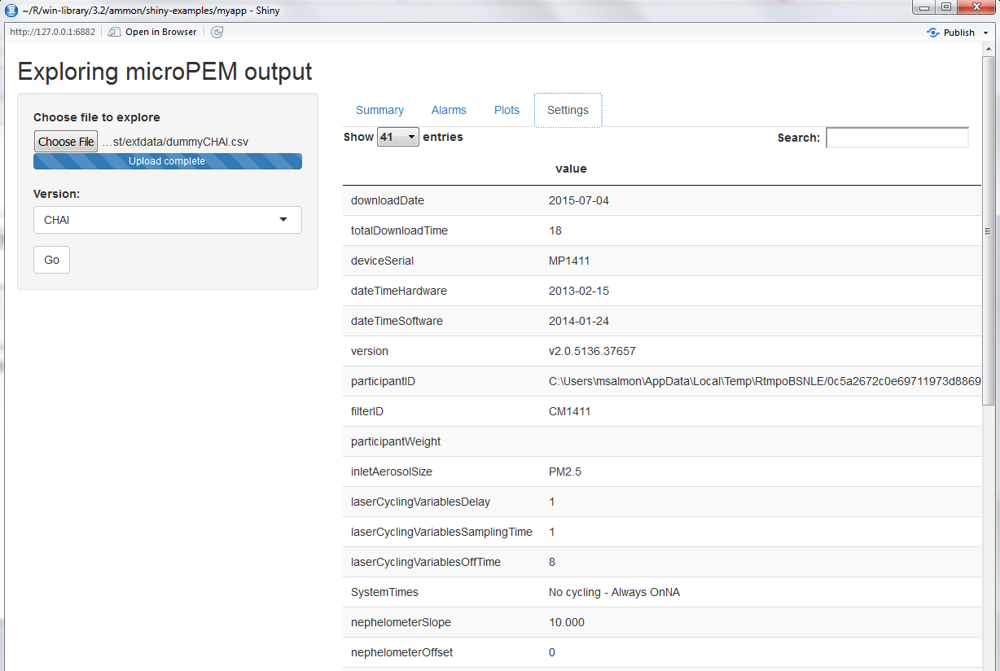

-   [Installation](#installation)
-   [Introduction](#introduction)
-   [Checking individual files: from input data to `micropem` objects](#checking-individual-files-from-input-data-to-micropem-objects)
    -   [Fields](#fields)
        -   [`settings` field](#settings-field)
        -   [`measures` field](#measures-field)
        -   [`filename` field](#filename-field)
    -   [The `convert_output` function.](#the-convert_output-function.)
    -   [Visualizing information contained in a `micropem` object](#visualizing-information-contained-in-a-micropem-object)
        -   [Plot method](#plot-method)
        -   [`summary` method](#summary-method)
        -   [Shiny app developped for the CHAI project](#shiny-app-developped-for-the-chai-project)
-   [From a bunch of output files to data ready for further analysis](#from-a-bunch-of-output-files-to-data-ready-for-further-analysis)

[](https://travis-ci.org/masalmon/RTImicropem) [](https://ci.appveyor.com/project/masalmon/rtimicropem) [](https://codecov.io/github/masalmon/RTImicropem?branch=master)

:construction\_worker: Please note that this package is under development. :construction\_worker:

Installation
============

``` r
library("devtools")
install_github("masalmon/RTImicropem", build_vignettes=TRUE)
```

Introduction
============

This package aims at supporting the analysis of PM2.5 measures made with RTI MicroPEM. [RTI MicroPEM](https://www.rti.org/sites/default/files/brochures/rti_micropem.pdf) are personal monitoring devices (PM2.5 and PM10) developped by [RTI international](https://www.rti.org/).

The goal of the package functions is to help in two main tasks:

-   Checking individual MicroPEM output files after, say, one day of data collection.

-   Building a data base based on output files, and clean and transform the data for further analysis.

For the examination of individual files, the package provides a function for transforming the output of a RTI MicroPEM into an object of a R6 class called `micropem`, functions for examining this information in order to look for possible problems in the data. The package moreover provides a Shiny app used for the field work of the CHAI project, but that could easily be adapted to other contexts.

This document aims at providing an overview of the functionalities of the package.

Checking individual files: from input data to `micropem` objects
================================================================

The MicroPEM device outputs a csv file with all the information about the measures, depending on the options chosen in RTI MicroPEM software when uploading data, for instance:

-   the measures themselves (relative humidity corrected nephelometer),

-   other measures that can help interpret them or check that no problem occured (temperature, relative humidity, battery, orifice pressure, inlet pressure, flow, accelerometer variables, reasons for shutdown, and variables related to user compliance),

-   a reminder of parameters set by the user (calibration parameters, frequency of measures)

-   and information about the device (filter ID, version of the software, etc). This is a lot of information, compiled in a handy csv format that is optimal for not loosing any data along the way, but not practical for analysis.

Therefore, the `micropem` package offers a R6 class called `micropem` for storing the information, that will be easier to use by other functions. The class has fields with measures over time and a field that is a list containing all the information located at the top of the MicroPEM output file, called `settings`. Here is a picture of a RTI MicroPEM output file showing how the information is stored in the R6 class.



Fields
------

### `settings` field

This field is a data.frame (dplyr tbl\_df) that includes 41 variables.

### `measures` field

This field is a data.frame (dplyr tbl\_df) with the time-varying variables.

### `filename` field

This field contains the full filename of the file that was used to generate the `micropem` object.

The `convert_output` function.
------------------------------

The `convert_output` only takes one arguments as input: the path to the output file. The result of a call to this function is an object of the class `micropem`. Below is a example of a call to `convert_output` followed by a call to the `print` method.

``` r
library("RTImicropem")
micropem_example <- convert_output(system.file("extdata", "CHAI.csv", package = "RTImicropem"))
class(micropem_example)
```

    ## [1] "micropem" "R6"

``` r
print(micropem_example)
```

    ## An object of class micropem (R6 class)
    ## A summary of measures is:
    ## 
    ## measure                      No. of not missing values   Median         Mean   Minimum   Maximum    Variance
    ## --------------------------  --------------------------  -------  -----------  --------  --------  ----------
    ## rh_corrected_nephelometer                         8634    49.00   49.3745657     45.00     93.00   1.6780557
    ## temp                                              2878    84.50   84.6830438     82.30     87.60   1.7180023
    ## rh                                                8634    54.60   55.0061733     46.20     64.90   7.6665285
    ## battery                                           1464     4.10    4.0872268      3.90      4.30   0.0078272
    ## inlet_press                                       2878     0.11    0.1111015      0.10      0.13   0.0000538
    ## orifice_press                                     2878     0.15    0.1505455      0.14      0.16   0.0000072
    ## flow                                              2878     0.77    0.7703023      0.77      0.78   0.0000029
    ## 
    ##  Settings were:
    ## 
    ##                                     value                  
    ## ----------------------------------  -----------------------
    ## downloadDate                        2015-07-04             
    ## totalDownloadTime                   18                     
    ## deviceSerial                        MP1411                 
    ## dateTimeHardware                    2013-02-15             
    ## dateTimeSoftware                    2014-01-24             
    ## version                             v2.0.5136.37657        
    ## participantID                                              
    ## filterID                            CM1411                 
    ## participantWeight                   NA                     
    ## inletAerosolSize                    PM2.5                  
    ## laserCyclingVariablesDelay          1                      
    ## laserCyclingVariablesSamplingTime   1                      
    ## laserCyclingVariablesOffTime        8                      
    ## SystemTimes                         No cycling - Always On 
    ## nephelometerSlope                   10                     
    ## nephelometerOffset                  0                      
    ## nephelometerLogInterval             10                     
    ## temperatureSlope                    10                     
    ## temperatureOffset                   0                      
    ## temperatureLog                      30                     
    ## humiditySlope                       10                     
    ## humidityOffset                      0                      
    ## humidityLog                         10                     
    ## inletPressureSlope                  40.950.000             
    ## inletPressureOffset                 0                      
    ## inletPressureLog                    30                     
    ## inletPressureHighTarget             1280                   
    ## inletPressureLowTarget              768                    
    ## orificePressureSlope                40.950.000             
    ## orificePressureOffset               0                      
    ## orificePressureLog                  30                     
    ## orificePressureHighTarget           2167                   
    ## orificePressureLowTarget            1592                   
    ## flowLog                             30                     
    ## flowHighTarget                      900                    
    ## flowLowTarget                       200                    
    ## flowWhatIsThis                      0.5                    
    ## accelerometerLog                    5                      
    ## batteryLog                          60                     
    ## ventilationSlope                    NA                     
    ## ventilationOffset                   NA

Visualizing information contained in a `micropem` object
--------------------------------------------------------

### Plot method

The R6 `micropem` class has its own plot method. It allows to draw a plot of all time-varying measures against the `timeDate` field. It takes two arguments: the `micropem` object to be plotted, and the type of plots to be produced, either a "plain" `ggplot2` plot with 6 facets, or its interactive version produced with the `ggiraph` package -- the corresponding values of type are respectively "plain" and "interactive".

Below we show to examples of uses of the plot method on a `micropem` object.

This is a "plain" plot.

``` r
data("micropemChai")
par(mar=c(1,4,2,1))
micropemChai$plot()
```



The code below would produce an interactive representation: the y-value is displayed when mouse is over each point. It is intended to be used as quick visualization tool as well, not as a plot method for putting a nice figure in a paper.

``` r
library("ggiraph")
p <- micropemChai$plot(type = "interactive")
ggiraph(code = {print(p)}, width = 10, height = 10)
```

### `summary` method

Plotting the `micropem` object is already a good way to notice any problem. Another methods aims at providing more compact information about the time-varying measures. It is called `summary` and outputs a table with summary statistics for each time-varying measures, except timeDate.

Below is an example of use of this method.

``` r
library("xtable")
data("micropemChai")
results <- micropemChai$summary()
results %>% knitr::kable()
```

| measure                     |  No. of not missing values|  Median|        Mean|  Minimum|  Maximum|   Variance|
|:----------------------------|--------------------------:|-------:|-----------:|--------:|--------:|----------:|
| rh\_corrected\_nephelometer |                       8634|   49.00|  49.3745657|    45.00|    93.00|  1.6780557|
| temp                        |                       2878|   84.50|  84.6830438|    82.30|    87.60|  1.7180023|
| rh                          |                       8634|   54.60|  55.0061733|    46.20|    64.90|  7.6665285|
| battery                     |                       1464|    4.10|   4.0872268|     3.90|     4.30|  0.0078272|
| inlet\_press                |                       2878|    0.11|   0.1111015|     0.10|     0.13|  0.0000538|
| orifice\_press              |                       2878|    0.15|   0.1505455|     0.14|     0.16|  0.0000072|
| flow                        |                       2878|    0.77|   0.7703023|     0.77|     0.78|  0.0000029|

### Shiny app developped for the CHAI project

In the context of the [CHAI project](http://www.chaiproject.org/), we developped a Shiny app based on the previous functions, that allows to explore a MicroPEM output file. The app is called by the function `run_shiny_app` with no argument. There is one side panel where one can choose the file to analyse. There are four tabs:

-   One with the output of a call to the `summary` method of the `micropem` object created,

-   One with the output of a call to the `alarmCHAI` function that performs a few checks specific to the CHAI project,

-   One with the output of a call to the plot method,

-   One with the output of a call to `summarySettings`.

This app allows the exploration of a MicroPEM output file with no R experience.

Below we show screenshots of the app.









From a bunch of output files to data ready for further analysis
===============================================================

The `batch_convert` function allows to convert a set of MicroPEM output files into two csv files, one containing the settings, one containing the measures, in each case with a filename column representing the full filename of the original file.

These csv files can then be used for transformation by device ID for instance, or for analysis by date, or by participant ID of a study if the participant ID is contained in the filename or in the initial MicroPEM output files. The csv file with all the settings of all MicroPEM output files can help checking whether the different monitoring sessions were done in similar conditions.
